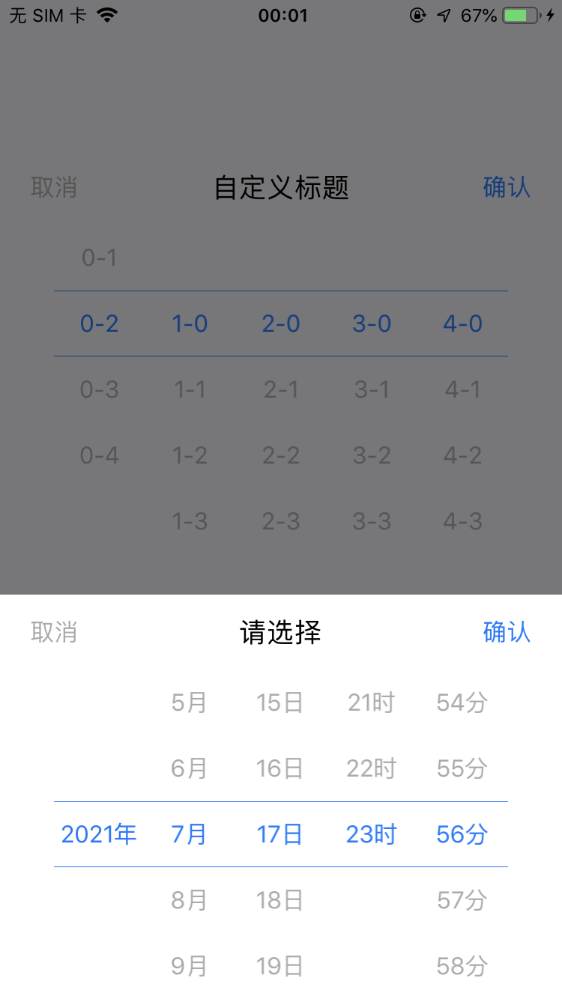
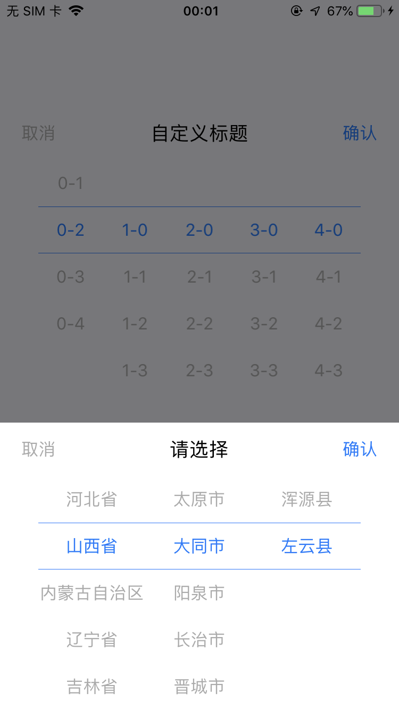

# KKPickerView
一个 UI 扁平化风格的选择控件, 支持任意行数与指定高亮行, 包括日期选择与地区选择 
## 日期选择 
 
## 地区选择 

# 具体用法参见 Demo
# Note 
UI 实现参考 [PGPickerView](https://github.com/xiaozhuxiong121/PGPickerView)  
地区数据来源于 [BRPickerView](https://github.com/91renb/BRPickerView)